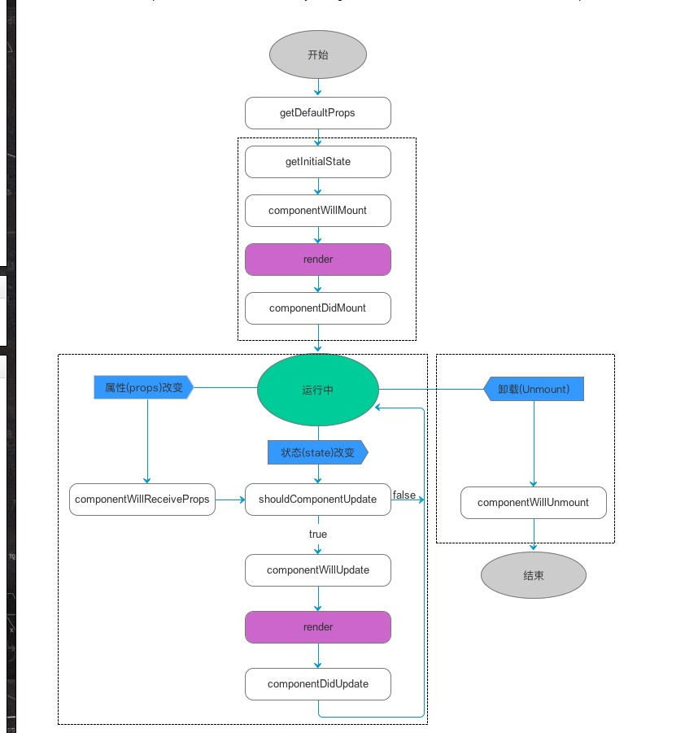

* 安装包的时候到底是--save还是--save-dev？一般是--dev。
* 利用yeoman一键构建项目的时候，操作的有cfg文件夹下的base，dist，在base里面设置输出流和代理以及使得手机能通过本地局域网访问本地服务器的0.0.0.0的设置。在dev这边设置vendor属性，用于全局引用的js。
* 在index.js里面引入react-router，进行路由操控。
* 组件里面最好很细，能够公用，拆的越细，到时候用起来越方便，样式也最好写在组件内。

>     max-height: 100%;
>     vertical-align: middle;
>     max-width: 100%
>     这3句代码可以设置一个上传头像原样比例显示的图片框。

* 利用height：0；width:100%,padding-top来用百分比控制盒子大小，达到自适应的要求。
* rem布局，给html在不同的屏幕宽度通过css设置font-size的不同大小，然后对于所有元素的像素大小全部以rem为单位进行设置。
* 在每次提交前，先过一遍有没有多删多写或者少删东西，或者说可以在当前文件中全局搜索一下console和alert进行删除。

```javascript
阻止页面滑动
$("body").on("touchmove",function(event){
event.preventDefault;
}, false)
//这里的body可以相对应的替换成其他合适的容器
然后点击取消或者确定时再取消body上的绑定
$("body").off("touchmove");
```

* 在less中无法直接使用css3属性，calc（）。需要使用另一种写法，例如：width:e("calc(100% - 4rem)");

* 定位时，left:0;right:0;以及margin:0 auto;可以使得居中。

* Refs 是不可控组件，使用state控制value是可控组件。可控组件的默认值是声明在state的初始化中的。不可控组件是写在input输入框的defaultValue属性上。

* if 语句和 for 循环在 JavaScript 中不是表达式，因此它们不能直接在 JSX 中使用，所以你可以将它们放在周围的代码中。即这些if ，for可以在function中使用，但是不能在return后面使用。不能跟jsx语法格式中使用，需要使用变量。或者三元表达式、

* React渲染列表或者说多个相同组件，使用的是map的时候，需要一个unique key。唯一的码

  ```jsx
    const listItems = numbers.map((number) =>
      <li key={number.toString()}>
        {number}
      </li>
    );
                                  
  ```

* React的生命周期 还是很有用的。

  ```javascript
  首次实例化

  getDefaultProps
  getInitialState
  componentWillMount
  render
  componentDidMount
  实例化完成后的更新

  getInitialState
  componentWillMount
  render
  componentDidMount
  存在期
  组件已存在时的状态改变

  componentWillReceiveProps
  shouldComponentUpdate
  componentWillUpdate
  render
  componentDidUpdate
  销毁&清理期
  componentWillUnmount
  说明
  生命周期共提供了10个不同的API。

  1.getDefaultProps

  作用于组件类，只调用一次，返回对象用于设置默认的props，对于引用值，会在实例中共享。

  2.getInitialState

  作用于组件的实例，在实例创建时调用一次，用于初始化每个实例的state，此时可以访问this.props。

  3.componentWillMount

  在完成首次渲染之前调用，此时仍可以修改组件的state。

  4.render

  必选的方法，创建虚拟DOM，该方法具有特殊的规则：

  只能通过this.props和this.state访问数据
  可以返回null、false或任何React组件
  只能出现一个顶级组件（不能返回数组）
  不能改变组件的状态
  不能修改DOM的输出
  5.componentDidMount

  真实的DOM被渲染出来后调用，在该方法中可通过this.getDOMNode()访问到真实的DOM元素。此时已可以使用其他类库来操作这个DOM。

  在服务端中，该方法不会被调用。

  6.componentWillReceiveProps

  组件接收到新的props时调用，并将其作为参数nextProps使用，此时可以更改组件props及state。

      componentWillReceiveProps: function(nextProps) {
          if (nextProps.bool) {
              this.setState({
                  bool: true
              });
          }
      }
  7.shouldComponentUpdate

  组件是否应当渲染新的props或state，返回false表示跳过后续的生命周期方法，通常不需要使用以避免出现bug。在出现应用的瓶颈时，可通过该方法进行适当的优化。

  在首次渲染期间或者调用了forceUpdate方法后，该方法不会被调用

  8.componentWillUpdate

  接收到新的props或者state后，进行渲染之前调用，此时不允许更新props或state。

  9.componentDidUpdate

  完成渲染新的props或者state后调用，此时可以访问到新的DOM元素。

  10.componentWillUnmount

  组件被移除之前被调用，可以用于做一些清理工作，在componentDidMount方法中添加的所有任务都需要在该方法中撤销，比如创建的定时器或添加的事件监听器。 
  ```

  

## ECMAScript6

* 解构赋值：型如 const { renderInfiniteLoader, refreshPostByTheme, renderListItem, loadPostsByTheme } = this。会将后面对象中同名属性的值赋值给前面的变量，且对象赋值不按顺序，查找的是相同的属性名。也可以给前面的变量赋初始值。但是若要赋值成功，需要后面对象中该对应属性名的值=== undefined。即没有该属性，或者 const { renderInfiniteLoader = 0 } = { renderInfiniteLoader : undefined  }; 并且在这种赋值方式时，最后不要加（），会引起报错或者异常，详细看http://es6.ruanyifeng.com/#docs/destructuring   ;    

```javascript
（1）交换变量的值
      let x = 1;
      let y = 2;
      [x, y] = [y, x];
上面代码交换变量x和y的值，这样的写法不仅简洁，而且易读，语义非常清晰。
（2）从函数返回多个值
  函数只能返回一个值，如果要返回多个值，只能将它们放在数组或对象里返回。有了解构赋值，取出这些值就非常方便。

    // 返回一个数组

    function example() {
      return [1, 2, 3];
    }
    let [a, b, c] = example();

    // 返回一个对象

    function example() {
      return {
        foo: 1,
        bar: 2
      };
    }
    let { foo, bar } = example();
（3）函数参数的定义

      解构赋值可以方便地将一组参数与变量名对应起来。

      // 参数是一组有次序的值
      function f([x, y, z]) { ... }
      f([1, 2, 3]);

      // 参数是一组无次序的值
      function f({x, y, z}) { ... }
      f({z: 3, y: 2, x: 1});
（4）提取JSON数据

        解构赋值对提取JSON对象中的数据，尤其有用。

        let jsonData = {
          id: 42,
          status: "OK",
          data: [867, 5309]
        };

        let { id, status, data: number } = jsonData;

        console.log(id, status, number);
        // 42, "OK", [867, 5309]
        上面代码可以快速提取 JSON 数据的值。

（5）函数参数的默认值

      jQuery.ajax = function (url, {
        async = true,
        beforeSend = function () {},
        cache = true,
        complete = function () {},
        crossDomain = false,
        global = true,
        // ... more config
      }) {
        // ... do stuff
      };
      指定参数的默认值，就避免了在函数体内部再写var foo = config.foo || 'default foo';这样的语句。

（6）遍历Map结构

      任何部署了Iterator接口的对象，都可以用for...of循环遍历。Map结构原生支持Iterator接口，配合变量的解构赋值，获取键名和键值就非常方便。

      var map = new Map();
      map.set('first', 'hello');
      map.set('second', 'world');

      for (let [key, value] of map) {
        console.log(key + " is " + value);
      }
      // first is hello
      // second is world
      如果只想获取键名，或者只想获取键值，可以写成下面这样。

      // 获取键名
      for (let [key] of map) {
        // ...
      }

      // 获取键值
      for (let [,value] of map) {
        // ...
      }
（7）输入模块的指定方法

    加载模块时，往往需要指定输入哪些方法。解构赋值使得输入语句非常清晰。

    const { SourceMapConsumer, SourceNode } = require("source-map");
```

* 字符串扩展方法  ：includes（），startsWith() ,endsWith(),用于增强indexOf()的功能。

  > includes用于返回字符串中是否有该字符。starsWidth()用于判断字符串是否以该字符开头，end是结尾，且三种方法都可以有第二个参数，为起始位置。var s = "dsfasdf ";  s.startsWith("d") //true
  >
  > s.startsWith("d",1) //false;

repeat()方法，用于将字符串重复，参数为数字。

**模板字符串**

> \`${name}\`写法.用于拼接字符串，{}里面可以放任意需要计算的变量。包括函数，简单运算，变量。而不像原来的字符串拼接的时候 "hello"+ name + "nice to meet to u";

* 数组扩展

```
将全局下面的parseInt和parseFloat方法移到number对象下面。原来使用是parseInt（）。现在是Number.parseInt().
Math.trunc方法用于去除一个数的小数部分，返回整数部分。
```

* 函数扩展

> 函数在定义形参的时候，可以赋默认值，在定义时直接给出。
>
> function m(x,y=10){console.log(x) //undefined;console.log(y)//10}
>
> 函数中参数引入了...变量名  的写法，代替原来的arguments。不过在...之后不能再有变量。
>
> ```javascript
> function push(array, ...items) {
>   items.forEach(function(item) {
>     array.push(item);
>     console.log(item);
>   });
> }
>
> var a = [];
> push(a, 1, 2, 3)
> ```

扩展运算符：（...[2,3,4]）用于将一个数组转为用逗号分隔的参数序列。常用于代替apply方法。主要也是在函数调用中使用。

> ```javascript
> var arr1 = [0, 1, 2];
> var arr2 = [3, 4, 5];
> Array.prototype.push.apply(arr1, arr2);
>
> // ES6的写法
> var arr1 = [0, 1, 2];
> var arr2 = [3, 4, 5];
> arr1.push(...arr2);
> ```

* 对象扩展

> Object.is()方法用于优化==和===。属于完全相等，对于+0 和-0 .NaN的比值，es5中 -0===+0 //true
>
> NaN === NaN //false、。用Object.is(NaN,NaN) //true。Object.is(+0,-0) //false
>

* git 提交时稍微看一下代码，确保没有误修改到。